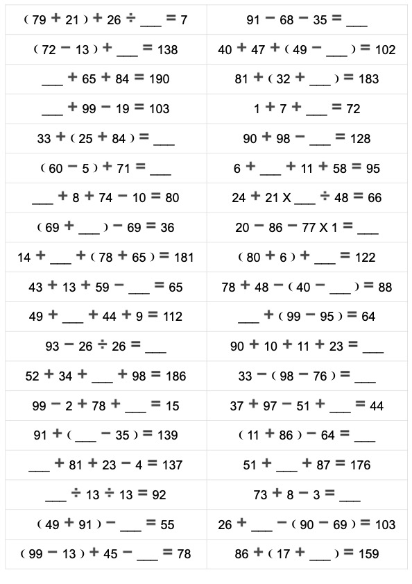

# Gen Arith4 Exercise - 四则运算练习题生成器

一个用 Go 语言编写的智能四则运算练习题生成工具，支持生成包含加减乘除的混合运算题目,适用于小学数学练习。

## 功能特点

- 🎯 **智能出题**：自动生成合法的四则运算题目，确保：
  - 减法结果不为负数（被减数 > 减数）
  - 除法能够整除且结果为正数
  - 所有中间计算步骤和最终结果均为正整数
  - 最终结果不超过 200

- 📐 **多种题型结构**：支持 6 种不同的表达式结构
  - 三个操作数：无括号、括号在前、括号在后
  - 四个操作数：无括号、括号在前、括号在后

- 🔢 **随机填空**：每道题目随机将一个操作数或结果替换为空白（`___`），增加练习难度

- 📄 **HTML 输出**：生成美观的 HTML 格式文件，支持：
  - 两列布局，适合打印
  - 响应式设计，适配屏幕显示
  - 打印优化，自动分页控制

## 安装

### 方式一：下载预编译二进制文件（推荐）

从 [GitHub Releases](https://github.com/deep2code/gen-arith4-exercise/releases) 页面下载适合您平台的最新版本：

| 平台 | 架构 | 文件名 |
|------|------|--------|
| Linux | amd64 (x86_64) | `gen-arith4-exercise-linux-amd64` |
| Linux | arm64 (ARM) | `gen-arith4-exercise-linux-arm64` |
| macOS | amd64 (Intel) | `gen-arith4-exercise-darwin-amd64` |
| macOS | arm64 (Apple Silicon) | `gen-arith4-exercise-darwin-arm64` |
| Windows | amd64 (x86_64) | `gen-arith4-exercise-windows-amd64.exe` |
| Windows | arm64 (ARM) | `gen-arith4-exercise-windows-arm64.exe` |

**Linux/macOS 使用方法：**
```bash
# 下载后赋予执行权限
chmod +x gen-arith4-exercise-<platform>-<arch>

# 运行
./gen-arith4-exercise-<platform>-<arch>
```

**Windows 使用方法：**
直接双击 `.exe` 文件或在命令行中运行。

### 方式二：从源码编译

#### 前置要求

- Go 1.26.2 或更高版本

#### 编译步骤

```bash
# 克隆仓库
git clone https://github.com/deep2code/gen-arith4-exercise.git
cd gen-arith4-exercise

# 编译
go build -o gen-arith4-exercise main.go

# 或直接运行
go run main.go
```

## 使用方法

### 基本用法

```bash
# 使用默认参数生成 228 道题目（45×5+3）
./gen-arith4-exercise

# 指定题目数量
./gen-arith4-exercise -count 100

# 指定输出文件名
./gen-arith4-exercise -filename my_exercises.html

# 同时指定数量和文件名
./gen-arith4-exercise -count 50 -filename practice.html
```

### 命令行参数

| 参数 | 说明 | 默认值 |
|------|------|--------|
| `-count` | 生成的练习题数量 | 228 (45×5+3) |
| `-filename` | 输出文件名 | `arth4-YYYYMMDD-HHMMSS.html` |

### 使用场景示例

#### 1. 日常练习（推荐数量）
```bash
# 生成适合一次练习的题目数量
./gen-arith4-exercise -count 50 -filename daily_practice.html
```

#### 2. 周练习
```bash
# 生成一周的练习量
./gen-arith4-exercise -count 200 -filename weekly_practice.html
```

#### 3. 专项训练
```bash
# 生成少量题目用于快速测试
./gen-arith4-exercise -count 20 -filename quick_test.html
```

#### 4. 批量生成
```bash
# 为不同日期生成不同的练习文件
./gen-arith4-exercise -count 100 -filename 2024_01_practice.html
./gen-arith4-exercise -count 100 -filename 2024_02_practice.html
```

### 示例输出

生成的 HTML 文件将包含类似以下的练习题：



```text
12 ➕ 34 ➖ 5 🟰 ___
___ ➗ 8 X 3 🟰 24
(15 ➖ 7) ➕ 20 🟰 ___
```

### 打印建议

生成的 HTML 文件已经过打印优化，您可以：

1. **直接打印**：用浏览器打开 HTML 文件，按 `Ctrl+P` (Windows/Linux) 或 `Cmd+P` (macOS) 打印
2. **保存为 PDF**：在打印对话框中选择“另存为 PDF”
3. **调整设置**：
   - 纸张大小：A4
   - 边距：默认或最小
   - 缩放：100%
   - 背景图形：可选（建议开启以获得最佳效果）

### 使用技巧

- 💡 **随机性**：每次运行都会生成不同的题目，可以多次运行获取不同练习
- 💡 **填空位置**：每道题随机隐藏一个数字（操作数或结果），增加思考难度
- 💡 **难度控制**：所有题目保证结果为正整数且不超过 200，适合小学阶段
- 💡 **两列布局**：HTML 采用两列显示，节省纸张空间

## 技术实现

### 核心算法

1. **操作数生成**：生成 1-99 范围内的随机正整数
2. **运算符选择**：根据当前操作数值智能选择合法的运算符
   - 减法：确保被减数 > 减数
   - 除法：确保能整除且商为正数
3. **结果验证**：确保最终结果在 1-200 范围内
4. **随机填空**：从操作数和结果中随机选择一个位置替换为变量

### 表达式结构

程序支持以下 6 种表达式结构：

#### 三个操作数
- `a op1 b op2 c` - 无括号
- `(a op1 b) op2 c` - 括号在前
- `a op1 (b op2 c)` - 括号在后

#### 四个操作数
- `a op1 b op2 c op3 d` - 无括号
- `(a op1 b) op2 c op3 d` - 括号在前
- `a op1 b op2 (c op3 d)` - 括号在后

### 符号说明

| 符号 | 含义 |
|------|------|
| ➕ | 加法 (+) |
| ➖ | 减法 (-) |
| X | 乘法 (×) |
| ➗ | 除法 (÷) |
| 🟰 | 等于 (=) |
| ❨ ❩ | 括号 |
| ___ | 待填空位置 |

## 项目结构

```
gen-arith4-exercise/
├── main.go              # 主程序文件
├── go.mod               # Go 模块定义
├── go.sum               # 依赖校验和
├── gen-arith4-exercise  # 编译后的可执行文件
└── README.md            # 项目说明文档
```

## 开发指南

### 代码结构

- `TokenType`：定义标记类型（运算符、操作数、结果等）
- `Token`：表达式中的单个标记
- `Exercise`：练习题结构（标记数组）
- `ArithmeticGenerator`：练习题生成器核心类

### 主要方法

- `genOperand()`：生成随机操作数
- `calc()`：执行二元运算
- `genValidOp()`：生成合法的运算符
- `genThreeNoParen()` / `genFourNoParen()`：生成无括号表达式
- `genThreeParenFirst()` / `genFourParenFirst()`：生成括号在前的表达式
- `genThreeParenLast()` / `genFourParenLast()`：生成括号在后的表达式
- `Generate()`：批量生成练习题
- `SaveToHTML()`：保存为 HTML 文件

### 扩展建议

如需添加新的表达式结构：

1. 在 `ArithmeticGenerator` 中添加新的生成方法（如 `genFiveNoParen()`）
2. 在 `Generate()` 方法的 `structures` 切片中注册新方法
3. 确保新结构满足合法性约束（结果为正、不超过最大值等）

## 许可证

本项目采用 MIT 许可证。详见 LICENSE 文件。

## 贡献

欢迎提交 Issue 和 Pull Request！

